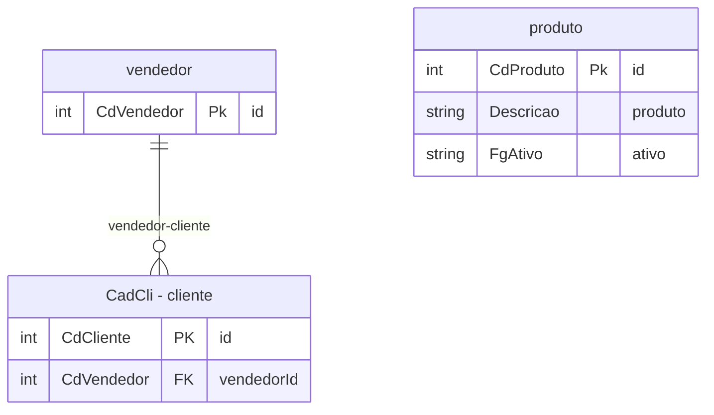

# Database Structure

```mermaid
erDiagram
  cliente["CadCli - cliente"] {
    int CdCliente PK "id"
    int CdVendedor FK "vendedorId"
  }
  vendedor {
    int CdVendedor Pk "id"
  }
  produto {
    int CdProduto Pk "id"
    string Descricao "produto"
    string FgAtivo "ativo"
  }

  vendedor 1--0+ cliente: vendedor-cliente
```
