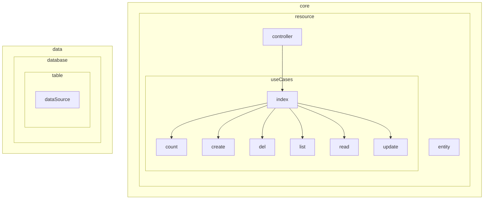

# Libraries

[Tailwind](https://tailwindcss.com/docs/flex-basis)

# Modules

1. types

2. utils

3. config

4. mocks

5. models

6. server

7. client

# Server

## Security

### Groups

Analista Qualidade
Auxiliar Manutenção
Auxiliar Produção
Auxiliar Qualidade
Consultor Comercial
Diretoria
Estoquista
Gestor Comercial
Gestor Estoque
Gestor Financeiro
Gestor Industrial
Gestor Qualidade
Inspetor Qualidade
Instrutor
Líder Manutenção
Líder Produção
TI

