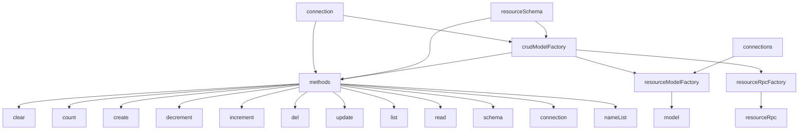

```mermaid
flowchart TD

connection --> methods
resourceSchema --> methods
methods --> clear
methods --> count
methods --> create
methods --> decrement
methods --> increment
methods --> del
methods --> update
methods --> list
methods --> read
methods --> schema
methods --> cnn[connection]
methods --> nameList

connection --> crudModelFactory
resourceSchema --> crudModelFactory
crudModelFactory --> methods

crudModelFactory --> resourceModelFactory
connections --> resourceModelFactory
resourceModelFactory --> model

crudModelFactory --> resourceRpcFactory
resourceRpcFactory --> resourceRpc

```